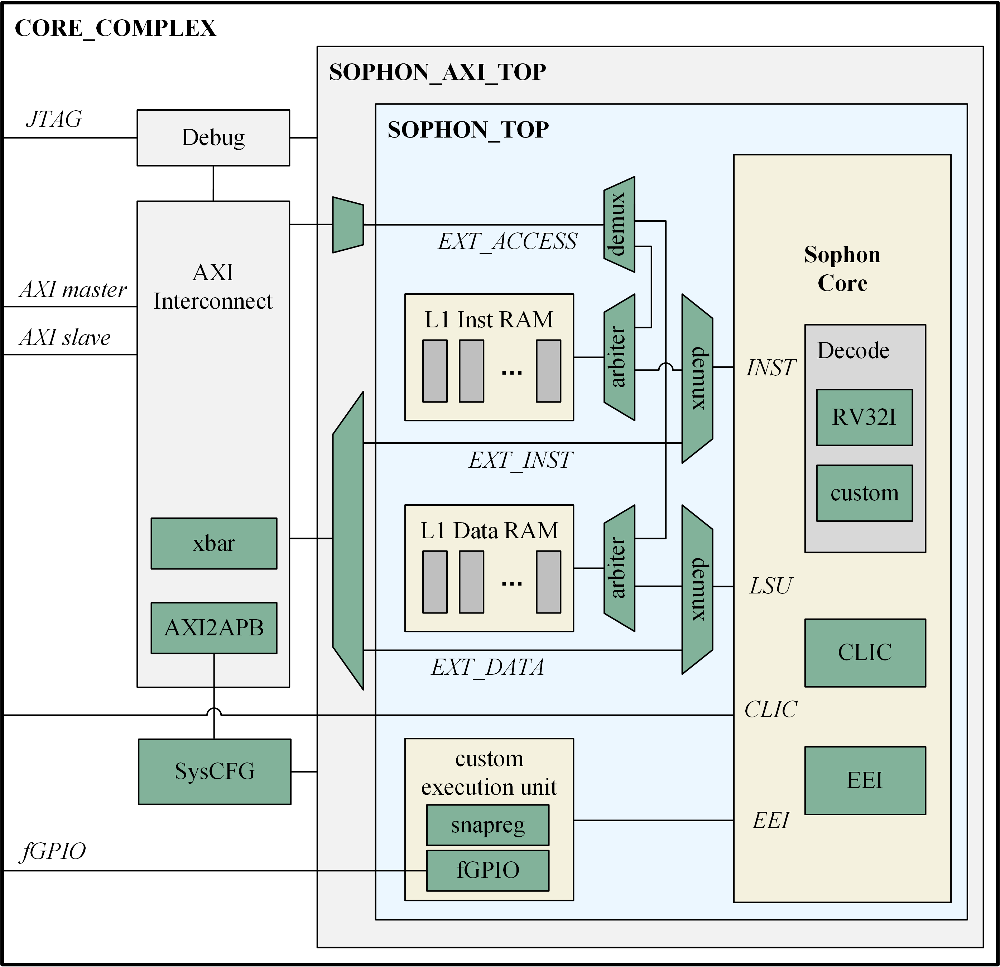

# Sophon - A time-repeatable RISC-V core optimized for control latency

Sophon is a tiny RISC-V core implements the RV32I(E) instruction set. It adopts a single-cycle microarchitecture and provides a time-repeatable feature. A lightweight and efficient ISA extension interface (EEI) is provided. Up to 32 operands can be transmitted in a single custom instruction. Sophon can work in standalone mode, accesses its tightly coupled memory, and achieves a high IPC of one. It can also be used as an auxiliary core when the external access interface (EXT_ACCESS) is enabled, working in tandem with a high-performance application core. 

Typical applications:

#### Embedded real-time system
Embedded real-time systems have strict timing requirements, where critical tasks should be completed within a given deadline. The time-repeatable and low-latency features can help to meet these constrains.

#### Domain-specific architecture
Domain-specific applications can be accelerated by developing custom execution units and connecting them to Sophon via the ISA extension interface.

#### High security application
Latency of all instructions supported by Sophon are equal, which is helpful to reduce side channel leakage when running security algorithm.

> Sophon is a 11-dimensional supercomputer contained in a proton from the science fiction The Three-Body Problem. This name is used as a metaphor for two features of this RISC-V core: 1)Tiny. 2)Scalable.


# Performance

Sophon is optimized for control latency. It achieves as low as one-cycle latency for:

#### Instruction latency

All instructions have a deterministic and repeatable one-cycle latency include:

- arithmetic instructions (e.g. add/sub/and/sll)
- transfer instructions (e.g. jal/jalr/beq)
- load/store instructions accessing TCM memory
- custom instructions

#### GPIO latency:

A fGPIO extension is developed to provide fast and accurate GPIO response. Following custom instructions can be used:

- IO.in.raw rs2,rd
- IO.in.bit rs1,rs2,rd
- IO.out.raw rs1,rs2,rd

#### Interrupt latency:

The Sophon core supports RISC-V CLIC spec v0.9-draft, which can provide a low-latency, vectored interrupt feature. Custom instructions sanpreg.save/snapreg.recover can be used to accelerate context saving and restoring.

Interrupt latency in shv/non-shv mode is 1 cycle and 6 cycles, respectively.


# Architecture

Sophon can be reused in different levels:

#### Sophon core
This is the simplest form of the Sophon core, exposing its original interfaces.

#### SOPHON_AXI_TOP
An AXI wrapper is provided to make it easier to be integrated into an AXI-based system. The tightly coupled memories are also included in this level.

#### CORE_COMPLEX
You can use it as a stand-alone RISC-V core or a co-processor directly.



Hardware parameters are defined in the following file:
> design/config/config_feature.sv

#### SOPHON_RVE
Enable RV32E ISA, this will reduce 16 registers.

#### SOPHON_RVDEBUG
Enable RISC-V Debug mode, debugger can access Sophon through a JTAG interface.

#### SOPHON_CLIC
Enable RISC-V CLIC extension.

#### SOPHON_EEI
Enable the ISA extension interface (EEI) to support custom instructions.

#### EEI_RS_MAX / EEI_RD_MAX
Define the maximum rs/rd channel in EEI.

#### SOPHON_EXT_INST
Enable the external instruction interface.

#### SOPHON_EXT_DATA
Enable the external data interface.

#### SOPHON_EXT_ACCESS
Enable the external access interface, then external masters can access the tightly coupled memories of Sophon.


# Quick start

Requirements
- RISC-V toolchain
- Verilator (version above 4.200)
- GTKWave

1. Checkout the repository
```sh
git clone https://github.com/timingwalker/sophon.git
```

2. Build the design and run a test case
```sh
cd vrf/sophon/
make build_sim
```

3. Check the waveform
```sh
gtkwave wave.vcd
```

4. Run a regression test
```sh
make regress
```


# FPGA

Currently the Sophon core is supported on the Genesys 2 board. A pre-build bitstream can be found in the release page.

You can also build a new bitstream by yourself:
```sh
cd fpga
make gen_ip
make fpga
```

Once the bitstream is downloaded to the FPGA, you can test if the design is correct:
```sh
cd vrf/riscv-tests/debug
./gdbserver.py targets/RISC-V/sophon.py
```


# software

You can compile your software and run it in the FPGA platform.

1. copy software template
```sh
cd sw
cp hello yourapp
```

2. Modify the variable `PROGRAM` in the Makefile
```sh
cd yourapp
vim Makefile
```

3. Compile
```sh
make
```

The generated files are stored in sw/build/yourapp. You can download it (yourapp.elf) to the FPGA using Openocd/gdb. The Openocd configuration file is:
```sh
sw/common/sophon.cfg
```


# Publication

If you are interested in Sophon and use it in your work, please cite:

#### Sophon: A time-repeatable and low-latency architecture for embedded real-time systems based on RISC-V

> NOTE: Several latencies are further optimized after this paper is published:
> - Latency of load/store instruction accessing TCM is reduced from 2 cycles to 1 cycle.
> - Interrupt latency in CLIC shv mode is reduced from 3 cycles to 1 cycle.
> - Interrupt latency in CLIC non-shv mode with snapreg instruction is reduced from 7 cycles to 6 cycle.


# Issues

If you find any problems, please report it by creating a new issue.

